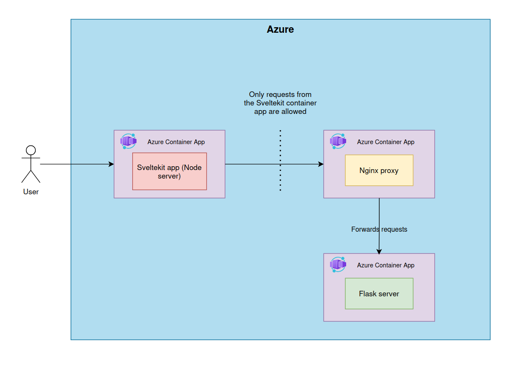

# Imagination-ui

This repository contains the code for a Sveltekit app for the Imagination web app.

The app can be previewed at https://imagination-ui.calmdesert-0db5aa99.northeurope.azurecontainerapps.io
NOTE: Since this is a hobby project, the container app is by default not running in order to save costs. This means that the first time visit there will be a 15-20 sec wait time while the containers are started.

## Overall app architecture



## Development

**Requirements**

- Node 20.16.0
- NPM 10.8.1

1. Install packages
```npm install```

2. Run the app in dev environment
```npm run dev```

## Production build

There are a few ways to preview the production build, depending on how extensively you wish to mimic production.

1. Local production build with Vite

Create a production version of your app:
```npm run build```
You can preview the production build with `npm run preview`, which uses Vite.

2. Local production build with Node

First make sure you have a ```.env.production``` file with appropriate values.

Create a production version of your app:
```npm run build```

Run the app using a Node server
```ORIGIN=http://localhost:3000 node --env-file=.env.production build```

3. Production build using Docker
- Requires Docker Desktop

Build image and run the container with one command
```ORIGIN=http://localhost:3000 docker compose up -d```
